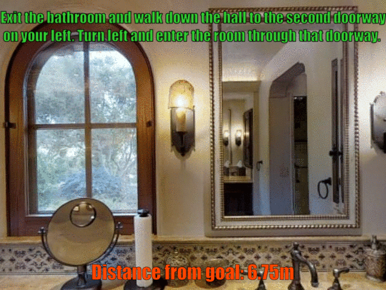
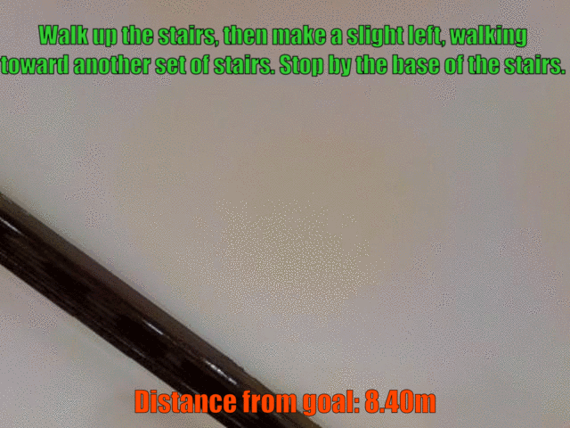
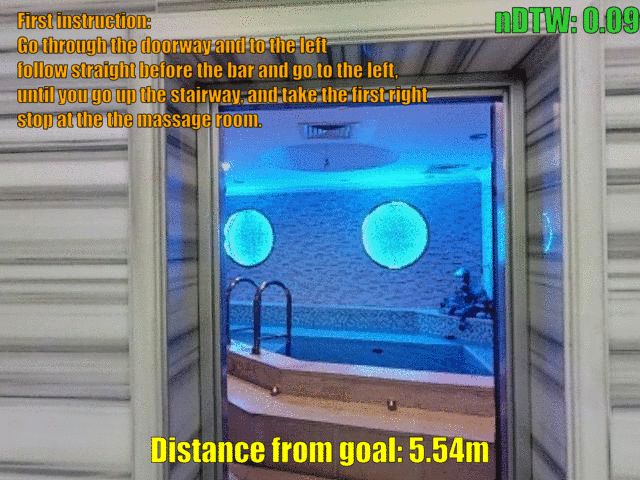

# Perceive, Transform, and Act
This code is not intended for plug and play use, but it should be integrated with the Matterport3d simulator. In this repository, we report only the code to build our PTA agent and training/testing it on r2r and r4r.
Folders and code in this repo are supposed to be placed inside the ```tasks/R2R/``` directory of the [Matterport3D simulator](https://github.com/peteanderson80/Matterport3DSimulator) project.

From a practical point of view, our code makes the following contributions: it is the first code baseline for VLN that transparently integrates two environments (one for low-level VLN, one for high-level VLN), and we add four new metrics into the Evaluation class (CLS, DTW, nDTW, and sDTW) in order to aid future research. The user can switch from low-level to high-level VLN using the ```--high_level``` option when running the code. The environment and the agent rollout function are changed coherently with that option.

## Installation

To run and test our code, you first need to install the Matterport3d simulator.
As a first step, clone the Matterport3d simulator repo by Anderson et al.

```
git clone --recursive https://github.com/peteanderson80/Matterport3DSimulator
cd Matterport3DSimulator
```

please install the simulator according to their instructions and place the [precomputed ResNet-152 (imagenet) features](https://www.dropbox.com/s/715bbj8yjz32ekf/ResNet-152-imagenet.zip?dl=1) provided with their work into the ```Matterport3DSimulator/img_features``` folder. In our experiments, we have built the simulator from source by installing all the dependencies. We also employ a virtual environment created with conda:

```
conda create -n pta python=3.6.8
source activate pta
```

Then clone this repo and switch it with the original ```/tasks/R2R``` folder.
Make sure that all the requirements listed in the requirements.txt file are installed in your virtual environment (we also provide a copy of our ```pip freeze``` output). 

```
cd tasks
rm -r R2R
git clone https://github.com/paperid-2377/PTA
mv PTA R2R
cd R2R
pip install -r requirements.txt
```

Our code also depends on [Speaksee](https://github.com/aimagelab/speaksee).

```
cd Matterport3DSimulator
git clone https://github.com/aimagelab/speaksee
cd speaksee
pip install -e .
cd ..
```

You can now build the simulator from source. If you are using a virtual environment created with conda, you should specify the path to your python bin:

```
cd Matterport3DSimulator
mkdir build
cd build
cmake -DOSMESA_RENDERING=ON -DPYTHON_EXECUTABLE:FILEPATH='path_to_your_python_bin' ..
make
```

## Training and Testing

You can run the code from the main directory of Matterport3d after copying this repo in the tasks/R2R folder.

To train PTA from scratch, run:

```
python tasks/R2R/main.py --name train_from_scratch \
                         --plateau_sched \
                         --lr 1e-4 \
                         --max_episode_len 30
```

We also provide weights obtained with the training described in the paper. If you wish to reproduce the results in our paper, run:

```
python tasks/R2R/main.py --name test_ll \
                         --max_episode_len 30 \
                         --eval_only \
                         --pretrained \
                         --load_from low_level
```

Our agent can also perform high-level Vision-and-Language Navigation.
To reproduce the results otained with the high-level setup, run:

```
python tasks/R2R/main.py --name test_hl \
                         --high_level \
                         --max_episode_len 10 \
                         --eval_only \
                         --pretrained \
                         --load_from high_level
```

## Visualizing Navigation Episodes

To make our qualitative results easier to visualize, we provide some .gif files that display some of the navigation episodes reported in our paper. We also show meaningful metrics to evaluate our results.

### Low-level VLN in R2R

<p>

  &nbsp; &nbsp;

</p>

### Low-level VLN in R4R

<p>

  &nbsp; &nbsp;

</p>

## Reproducibility Note

Our experiments were made using an Nvidia 1080Ti GPU, CUDA 10.0, and python 3.6.8. Using different hardware setups or software versions may affect results.
